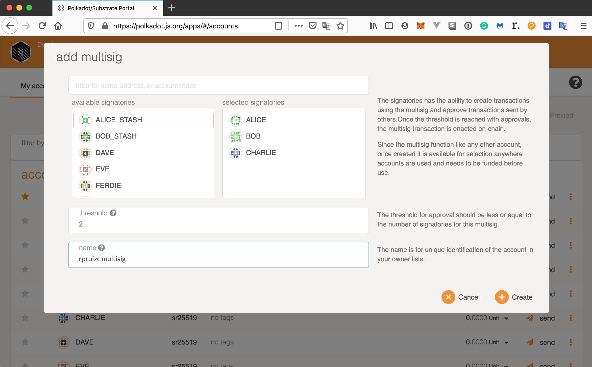
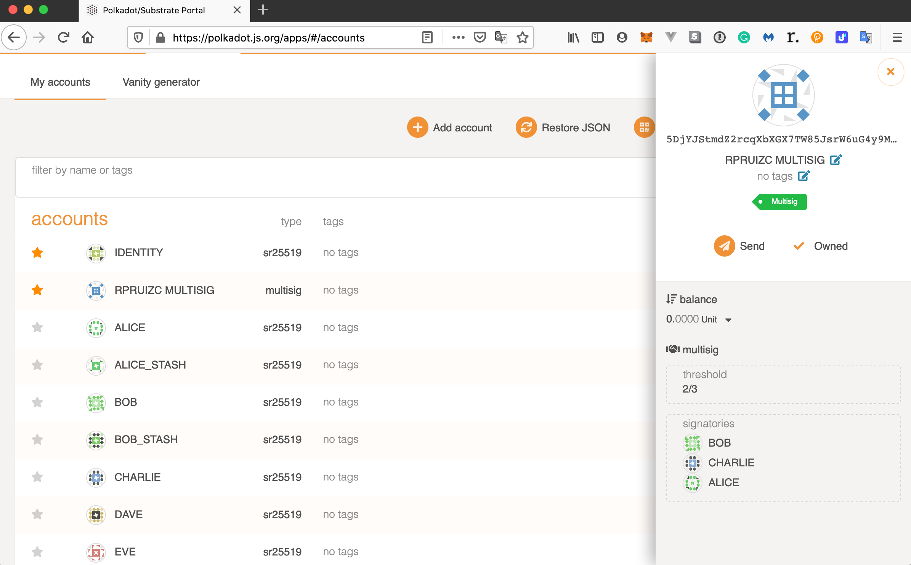
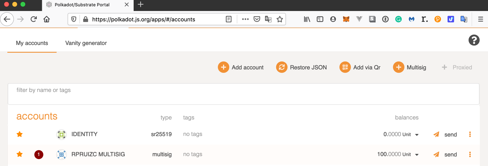
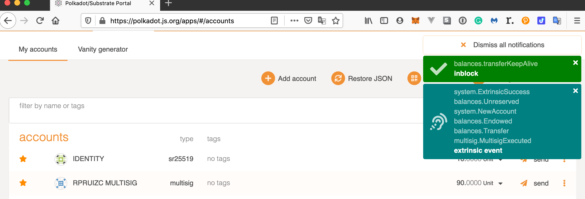

# [INTERMEDIATE CHALLENGE] FRAME Multisig

The following screenshots demonstrate the multisig pallet added to the node-template

## Adding a multisig wallet

.

### After `rpruizc multisig` wallet creation

.

### After `Alice` authorizes first

.

### After `Charlie` finishes the transaction to the  `Identity` wallet

.
